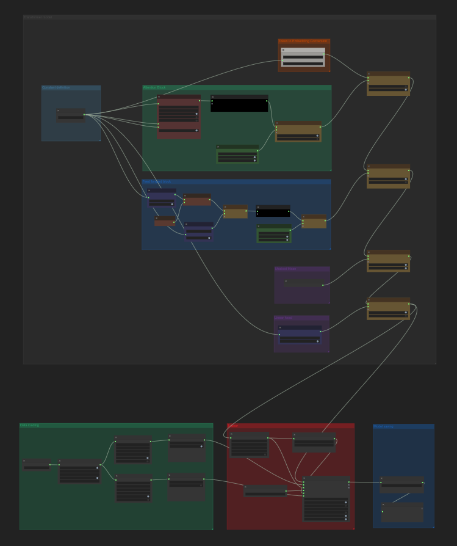

## Update — April 6, 2025

## Now You Can Try Building a Transformer Model from Scratch

You can use **ComfyUI-Pt-Wrapper** to build a Transformer encoder model from scratch for text classification.

Learn how to construct a Transformer encoder using basic components such as multi-head attention, layer normalization, linear layers, embedding layers, and residual connections. This workflow allows you to train the model for IMDB text classification and achieve around 85% accuracy!

  
*The complete setup of all required nodes is included in the example workflow.*

Check out the [Building Transformer From Scratch](docs/building_transformer_from_scratch.md) guide.

---

# ComfyUI-Pt-Wrapper

**ComfyUI-Pt-Wrapper** brings PyTorch model building and training into ComfyUI's node graph environment—**no coding required**.

It is built for ComfyUI users who want to explore machine learning without writing Python, and for researchers who want to prototype directly in visual workflows. Every operation, from tensor math to full training pipelines, can be configured through nodes.

Originally a focused spin-off of [ComfyUI-Data-Analysis](https://github.com/HowToSD/ComfyUI-Data-Analysis), this extension supports a wide range of ML workflows in image and text domains.

---

## What It Offers

- **No-code training workflows** for image and text classification
- Use pre-built model nodes for major architecture such as ResNet, LSTM, GRU, Transformer, or create your own model from various model nodes.
- Perform tensor operations like `add`, `gather`, `scatter`, `where`, etc.
- Support for processing text (e.g. tokenization, embedding) to feed to a model
- Featuring **200 nodes** as of March 28, 2025.
---

## Example Workflows

### Dog vs. Cat Classifier — No Code Needed
Train an image classifier on your own dataset—entirely in ComfyUI nodes.

[Step-by-step guide](docs/dog_cat_classification_model_training.md)

### ResNet on CIFAR-10
Train a ResNet achieving **94% validation accuracy**. A flexible baseline for your own image classification tasks.

  

### Transformer for Text Classification
Train a text classification model using a configurable Transformer model—all node-based.

[`embedding_transformer_classification.json`](examples/workflows/embedding_transformer_classification.json)

---

## Getting Started

- **Node Overview**: [Node Reference](docs/reference/node_reference.md)
- **Model Training Guide**: [Model Training Documentation](docs/model_training.md)

---

## Contributing

This project does not accept pull requests. Unsolicited PRs will be closed without review.

To suggest a feature or report an issue, open an Issue. All issues are reviewed and prioritized.

---

## Node Reference

Every supported node is documented in detail. Browse the [Node Reference](docs/reference/node_reference.md) to explore tensor operations, models, tokenization, distributions, loss functions, tensor operations and more.

Links in the reference section point directly to individual node docs for quick lookup.