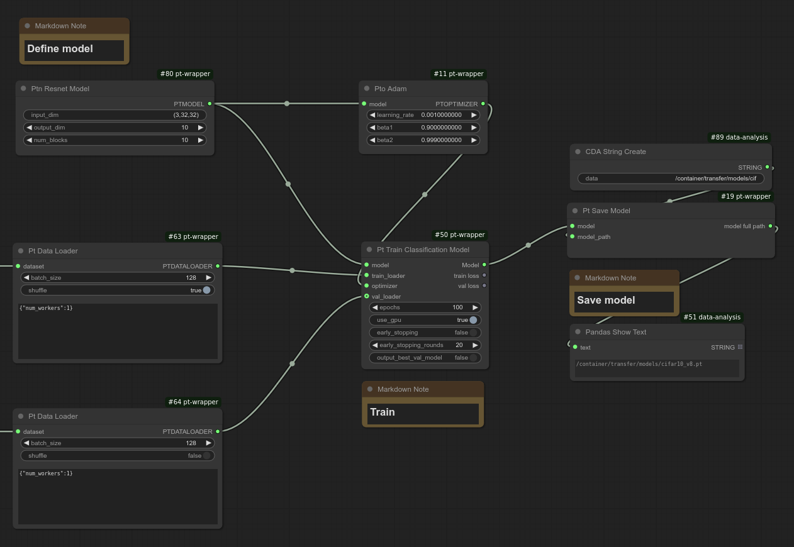

## Update (3/25/2025) 

GRU support has been added.
Check out new example workflow at `examples/workflows/gru_classification.json` which achieves approximately **87% validation accuracy** for IMDB sentiment classification (which is in the expected range for GRU).

---
# ComfyUI-Pt-Wrapper  

ComfyUI-Pt-Wrapper is a spin-off of [ComfyUI-Data-Analysis](https://github.com/HowToSD/ComfyUI-Data-Analysis), designed as a dedicated extension for PyTorch wrapper nodes originally included in the analysis extension.

This extension provides a comprehensive set of nodes for direct operations on PyTorch tensors, along with specialized nodes for machine learning tasks like ResNet.

If you need access to PyTorch's low-level methods (e.g., `add`, `div`, `max`, `where`, `scatter`, `gather`) to manipulate tensors or extract information—or if you're comfortable with ComfyUI and want to explore foundational PyTorch methods —this extension is for you.

You can train an image classification model using your own image data **without writing any code**.

Check out [this tutorial on classifying dogs and cats](docs/dog_cat_classification_model_training.md).

For visualization or analysis features, install ComfyUI-Data-Analysis as well.

The workflow directory offers user-friendly example workflows for training a high-performing ResNet model on CIFAR-10. One example achieved **94.34% accuracy** on the validation set. While not a state-of-the-art metric, it provides a solid starting point for customizing the workflow to your needs.

**ResNet model**

# Getting Started
If you're interested in direct operations on PyTorch tensors, check out the [Node Reference](docs/reference/node_reference.md) to explore the available nodes and see what operations are supported.

If you want to learn PyTorch model training, start with the [Model Training Documentation](docs/model_training.md).

## Contribution
🚫 **This project does not accept pull requests.**  
Unsolicited PRs will be **closed without review**.  

If you have a feature request or improvement suggestion, **please create an Issue instead**.  
All submitted issues will be reviewed and prioritized accordingly.
