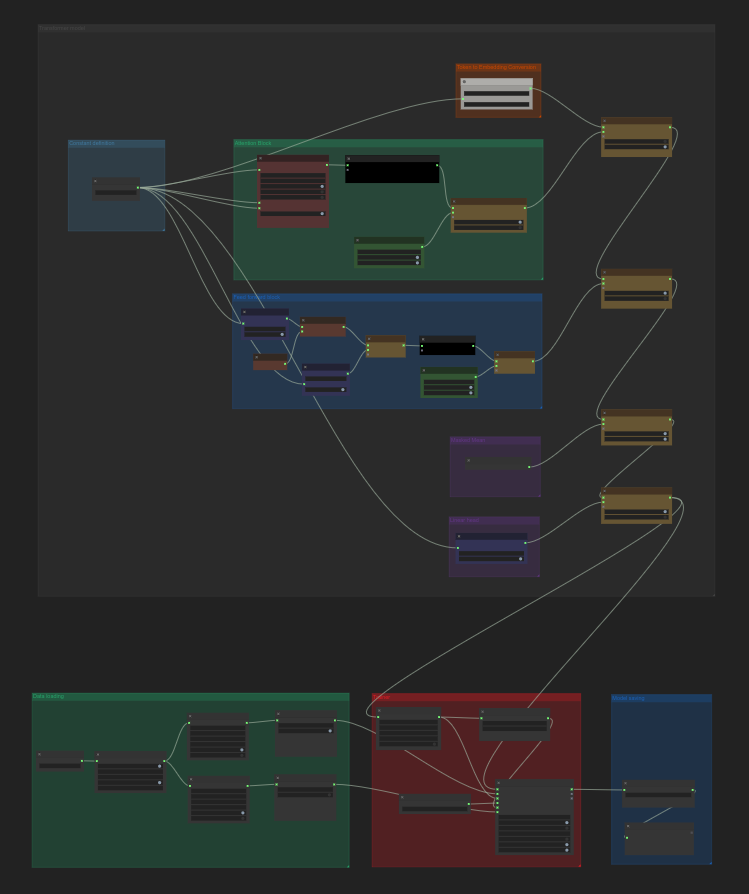

# Building Transformer From Scratch

You can use **ComfyUI-Pt-Wrapper** to build a Transformer encoder model from scratch for text classification.

In this workflow, we demonstrate how to construct a Transformer encoder using basic components such as multi-head attention, layer normalization, linear layers, embedding layers, and residual connections.  
Note: This guide does *not* cover implementing multi-head attention from scratch. If you'd like that topic addressed, please open a GitHub issue.

You can find the complete workflow at:  
`examples/workflows/mha.json`

The workflow consists of the following node groups:
* Loading data (green, bottom-left)
* Setting up the model, loss, optimizer, and scheduler (red, bottom-middle)
* Saving a model (blue, bottom-right)
* Defining a custom Transformer model (top, black)

---

## Loading Data

Use **Ptv Hf Dataset With Token Encode** to load a Hugging Face text dataset. This node uses a SentencePiece tokenizer to convert text into token IDs.

SentencePiece requires a pretrained model file. A compatible model is included in this package, sourced from [google-t5/t5-base](https://huggingface.co/google-t5/t5-base/tree/main), licensed under Apache 2.0.

The tokenizer's vocabulary size is **32000**, so this must be specified in the embedding layer.

**Ptv Hf Dataset With Token Encode**:
- Pads each sentence
- Generates an attention mask (1 for valid tokens, 0 for padding)

Use **Pt Data Loader** to batch the tokenized dataset for training.

---

## Setting Up Trainer

This workflow uses:
- **Pto AdamW** as the optimizer
- **Pto Lr Scheduler Cosine Annealing** as the learning rate scheduler

You can replace these with other optimizers/schedulers available in the extension.

Loss function: **Ptn BCE with Logits Loss**  
This includes a built-in sigmoid activation, so raw logits can be passed directly.

For training:
- Use **Pt Train Classification Transformer Model**
- Set `unpack_input = True`  
  This is required because the Data Loader outputs a tuple (tokens, attention mask), but the model expects unpacked inputs.

If the loss doesn’t decrease, check that this flag is correctly set.

You can enable `classification_metrics` to print validation accuracy during training.

---

## Model Saving

Use **Pt Save Model** to save the trained model to disk.

---

## Model

A Transformer encoder is composed of one or more encoder blocks. For instance, OpenCLIP (used in Stable Diffusion) has 12.

This example builds a model with a *single* encoder block:

Breakdown:
* **Embedding block** (top orange)
* **Attention block** (middle green)
* **Feedforward block** (bottom blue)
* **Classification head** (not shown)

---

## Embedding Block

The embedding layer maps token IDs to trainable vectors.  

* num_embeddings: Specify the vocabulary size of tokens.
* embedding_dim: Specify the dimension of each word embedding. In this case 256 is specified in a separate constant node and connected to this node. You can hard code the number, but it's easier to maintain if you define the embedding dimension in one place.

For example, with a vocabulary of 32,000 and an embedding size of 256, the embedding matrix is [32000 × 256].

---

## Attention Block

The attention block learns contextual relationships between tokens and transforms the sequence into a richer representation suited for downstream tasks (e.g., classification).

---

## Feedforward Block

This block consists of two linear layers and further refines the output from the attention block to better encode the sentence meaning.

---

## Classification Head

Transformers output 3D data: `(batch, sequence length, feature dim)`.  
For classification, this must be reduced to `(batch, prediction)`.

Common reduction strategies include:
- Using a specific token (e.g., [CLS])
- Taking the mean across the sequence

This workflow uses **mean pooling**, but **ignores padding tokens** when averaging.

The result is passed to a linear layer producing one logit per example.  
No sigmoid is applied here, as the loss function node includes it.

---

## Residual Block

Residual connections are a key innovation in deep learning. They:
1. Save the input
2. Process it
3. Add the original input back to the processed output

Transformers apply residuals in both the attention and feedforward blocks.  
This workflow uses **Ptn Residual** to wrap submodels with a residual connection.

---

## Model Chaining

Yellow blocks represent **model chaining**. For instance:
- The Embedding layer feeds into the Attention layer
- The Attention layer feeds into the Feedforward layer

Use **Ptn Chained Model With Attention Mask** to chain layers that require the attention mask (e.g., Multihead Attention).

This node handles:
- Passing attention masks only to layers that need them
- Maintaining correct data flow

You must explicitly specify which layers consume the attention mask.

---

## Expected Accuracy

With this workflow, you should reach around **85% validation accuracy** on the Hugging Face IMDB dataset.  
This is a solid performance for a Transformer built entirely from scratch.

---
