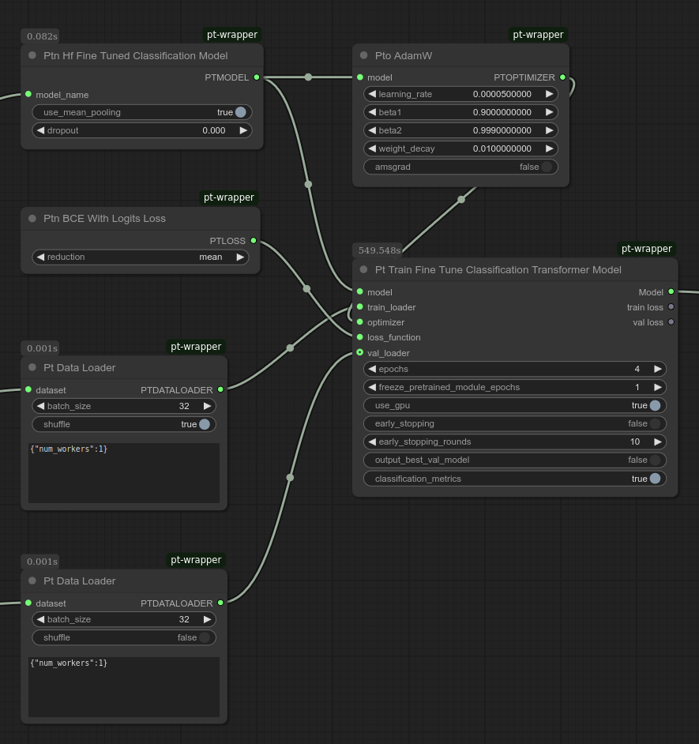

# Fine-tuning Hugging Face models for classification

You can use **ComfyUI-Pt-Wrapper** to fine-tune Hugging Face's pretrain models for text classification, such as sentiment analysis on a movie review dataset.

You can choose from the following models:
* bert-base-uncased
* roberta-base
* distilbert-base-uncased
* albert-base-v2

You can find an example workflow at `examples/workflows/distilbert_classification.json`.

The flow consists of the following groups of nodes:
* Loading data
* Setting up the model, loss, optimizer, and scheduler
* Training

## Loading Data

This phase consists of two steps:
* Specify a Hugging Face tokenizer encode for converting text to token IDs
* Specify a Hugging Face text dataset to load

## Specify a Hugging Face tokenizer encode for converting text to token IDs
Use **Hf Tokenizer Encode** to load the tokenizer for text to token ID convertion.
This node returns the encode function that dataset uses to the actual tokenization.
Note that each tokenizer is specific to the model. So you need to specify the same name as the model. You can specify one of the models as listed in the beginning of this document.  
 In the example workflow, a string node was created to specify the model name and this is connected to both the Encode node and the Model node.  
Note that you can set max_length to 0 to use the model specific max length.

## Specify a Hugging Face text dataset to load
Specify **Ptv Hf Dataset With Token Encode** to load the text data, and encode each word into token IDs using the Encode function above. **Select encode_return_dict to True.**

Then use **Pt Data Loader** to batch the data and feed it into the training node.

## Setting Up Optimizer and Scheduler

This workflow uses **Pto AdamW** as the optimizer. You can also experiment with other optimizers and schedulers included in this extension.

## Loss

Use **Ptn BCE with Logits Loss**, which includes a built-in sigmoid activation, allowing you to pass raw logits directly from the model.

## Model

Use an Transformer model with a linear head (**Ptn Hf Fine Tuned Classification Model**).
This model consists of:
* Hugging Face pretrained model
* Linear head that outputs a logit for binary classification

## Training

Specify **Pt Train Transformer Classification Model** and configure training parameters.  

## Expected Accuracy

Using this workflow, you should achieve around 92-93% validation accuracy on the Hugging Face version of the IMDB dataset with the pretrained DistilBERT model.

# Fine-tuning by freezing the pretrained module layers

ComfyUI-Pt-Wrapper also offers a node for fine-tuning by freezing the pretrained module layers.  
See `examples/workflows/distilbert_classification_2.json`.

Add **Pt Train Fine Tune Classification Transformer Model** node and specify the number of epochs to freeze in `freeze pretrained module epochs`.  
Also specify the total number of epochs in `epochs`.

For example, if you set `freeze_pretrained_module_epochs` to 1 and `epochs` to 4, then the weights for the pretrained module are frozen during the first epoch, and full fine-tuning takes place from epochs 2 to 4.

Using this example workflow, you can expect a validation accuracy of 92% or 93%.