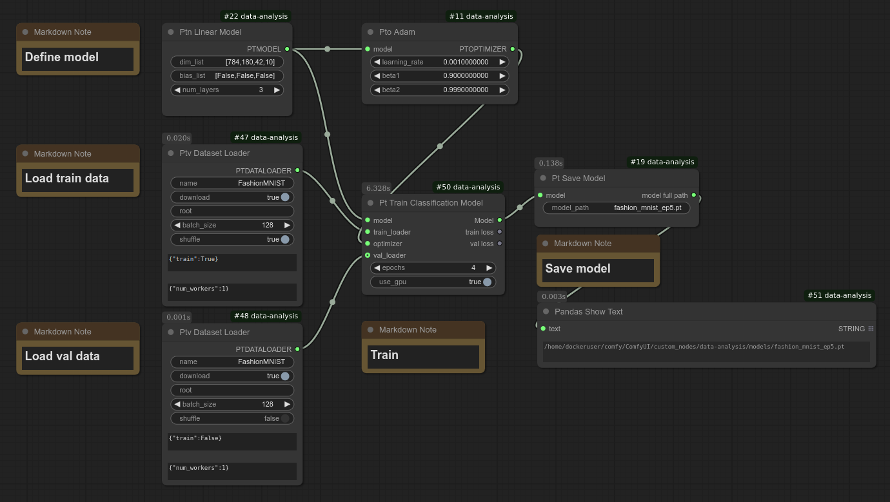
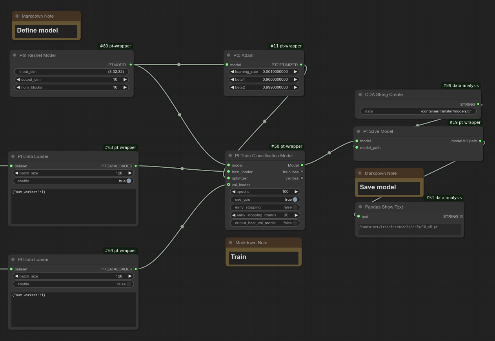
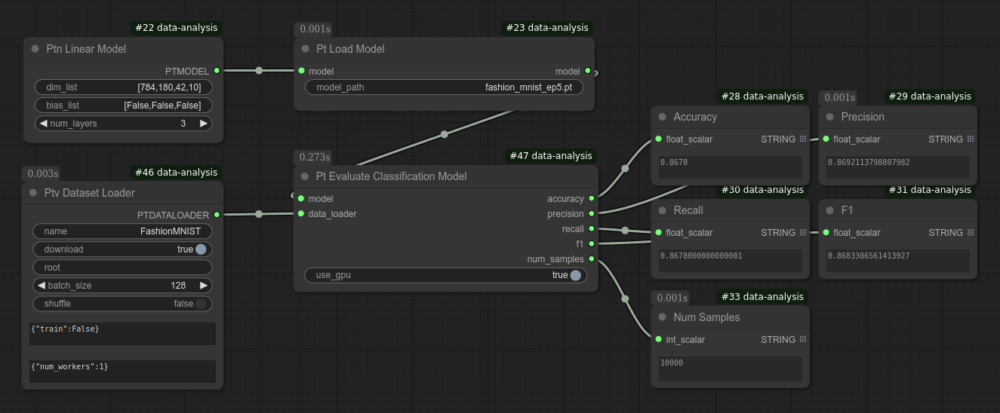
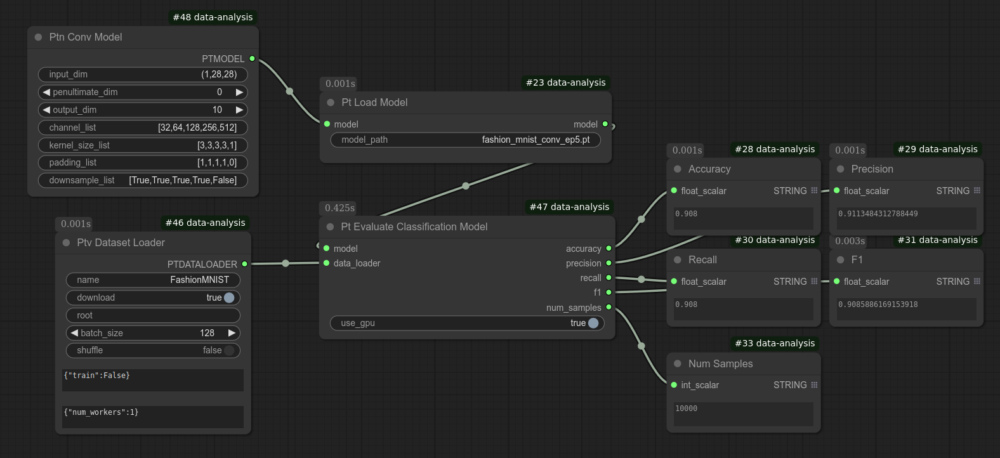

# Model Training

You can train a PyTorch model without any coding.
Training is as simple as a single click!  
Currently, following archituctures are supported (node names are in parentheses):
* MLP (Ptn Linear Model)
* Convolutional Network (Ptn Conv Model)
* ResNet (Ptn Resnet Model)

In addition, a single layer Linear model is supported as an example to illustrate the use (see the bottom of this page on how to use it):
* Linear (Ptn Linear)

You can adjust the model configuration including output dimension on the UI.

The system is designed to be modular. For example, to switch from a linear model to a convolutional model, you only need to replace the model node (see screenshot below).

You can choose to:
* Use your own images
* Use a public dataset

## Using Your Own Images

Check out [the dog and cat classification tutorial](dog_cat_classification_model_training.md).

## Public Datasets

Currently, only Fashion MNIST and CIFAR-10 have been tested. Other public datasets have not been verified yet, though they may work.  
If you try one and it doesn't work, please create an issue so I can investigate adding support.

To use these datasets, simply drag and drop the workflow files below into ComfyUI. The model will be downloaded automatically.  Make sure that you update the directory to save the trained model.

Linear model  
* Training: examples/workflows/fashion_mnist_train.json  
* Evaluation: examples/workflows/fashion_mnist_eval.json

Convolutional model  
* Training: examples/workflows/fashion_mnist_train_conv.json  
* Evaluation: examples/workflows/fashion_mnist_eval_conv.json

ResNet model
**Training**
* examples/workflows/cifar10_train_v8.json
* examples/workflows/cifar10_train_v11_2nd_run.json
  
**Evaluation**
* examples/workflows/cifar10_eval_v8.json
* examples/workflows/cifar10_eval_v11_2nd_run.json

This train_v8 model achieved 93.12% accuracy & train_v11_2nd_run model achieved 94.34 on CIFAR-10 (first run was 94.27%). train_v11_2nd_run added cosine annealing learning rate scheduler while train_v8 used fixed learning rate. While not state-of-the-art, these are strong results. Due to random initialization, data augmentation, and dataset shuffling, accuracy may vary slightly between runs. If your accuracy is significantly lower, consider running it multiple times or checking for potential issues in the training setup.

**Note: Before you try these workflows, please install ComfyUI-Data-Analysis extension.**

### Training workflow
**Linear model**

**Conv model**

*Close up of the conv node*

**ResNet model**

### Eval workflow
**Linear model**

**Conv model**

**ResNet model**

# Using the Single-Layer Linear Model

A single-layer linear model is included to illustrate how to connect various nodes.  
A workflow containing this model and related nodes is in the following file:  
`examples/workflows/simple_linear_regression_train.json`.

This workflow illustrates:
- How to generate linear regression test data
- How to plot the data
- How to train a model by connecting it to an optimizer
- How to make predictions using a trained model

If you run training, you will notice that the loss remains in the 20s–30s instead of approaching 0, as you might expect.

Do you know why this happens?
