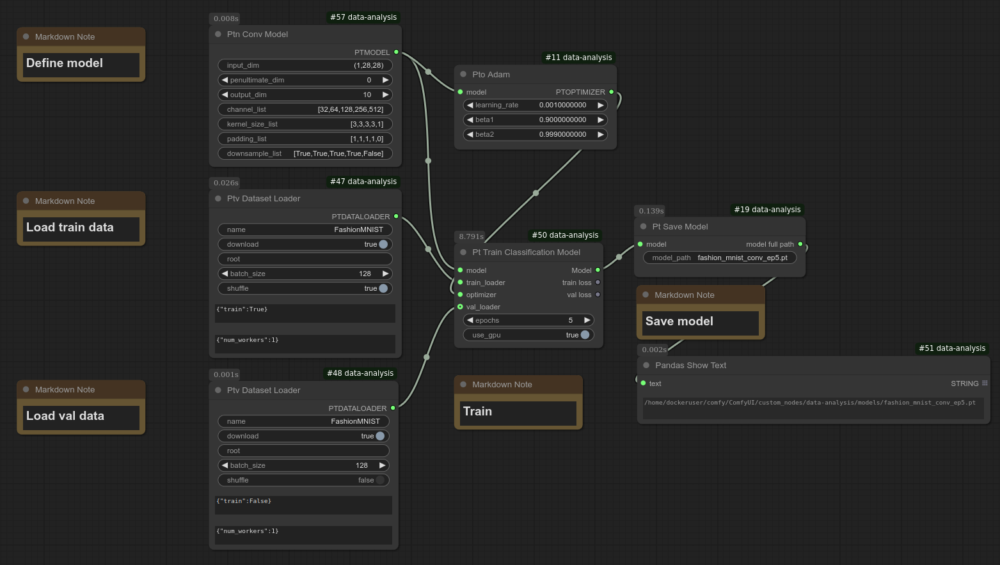

# Model Training

You can train a PyTorch model without any coding.
Training is as simple as a single click!  
Currently, classification models are supported for following architecture (node names are in parentheses):
* Linear (Ptn Linear Model)
* Convolutional Network (Ptn Conv Model)
* ResNet (Ptn Resnet Model)

You can adjust the model configuration including output dimension on the UI.

The system is designed to be modular. For example, to switch from a linear model to a convolutional model, you only need to replace the model node (see screenshot below).

You can choose to:
* Use your own images
* Use a public dataset

## Using Your Own Images

Check out [the dog and cat classification tutorial](dog_cat_classification_model_training.md).

## Public Datasets

Currently, only Fashion MNIST and CIFAR-10 have been tested. Other public datasets have not been verified yet, though they may work.  
If you try one and it doesn't work, please create an issue so I can investigate adding support.

To use these datasets, simply drag and drop the workflow files below into ComfyUI. The model will be downloaded automatically.  Make sure that you update the directory to save the trained model.

Linear model  
* Training: examples/workflows/fashion_mnist_train.json  
* Evaluation: examples/workflows/fashion_mnist_eval.json

Convolutional model  
* Training: examples/workflows/fashion_mnist_train_conv.json  
* Evaluation: examples/workflows/fashion_mnist_eval_conv.json

ResNet model
* Training: examples/workflows/cifar10_train_v8.json
* Evaluation: examples/workflows/cifar10_eval_v8.json

This model achieved 93.12% accuracy on CIFAR-10. While not state-of-the-art, it is a strong result. Due to random initialization, data augmentation, and dataset shuffling, accuracy may vary slightly between runs. If your accuracy is significantly lower, consider running it multiple times or checking for potential issues in the training setup.

**Note: Before you try these workflows, please install ComfyUI-Data-Analysis extension.**

### Training workflow
**Linear model**

**Conv model**

*Close up of the conv node*

**ResNet model**

### Eval workflow
**Linear model**

**Conv model**

**ResNet model**

