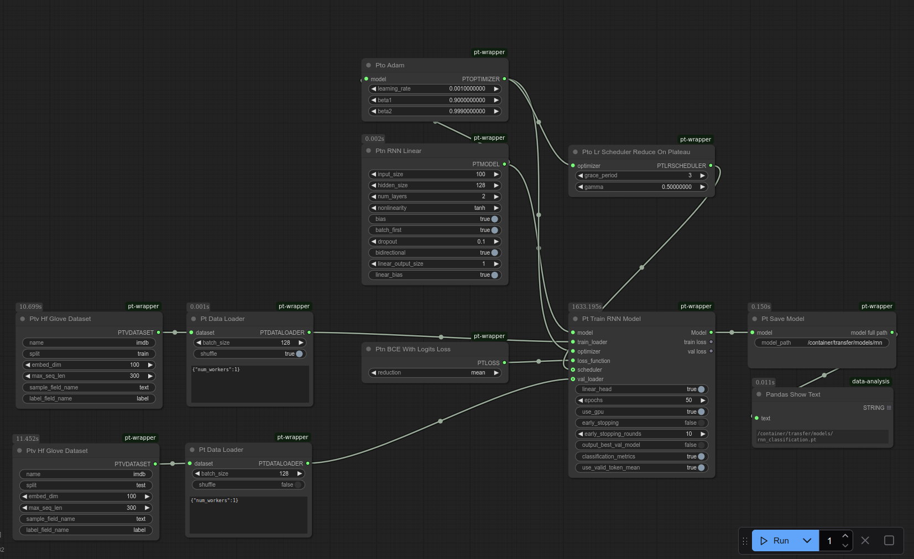

# Training RNN for Text Classification

You can use **ComfyUI-Pt-Wrapper** to train an RNN for text classification, such as sentiment analysis on a movie review dataset.

You can find the workflow at `examples/workflows/rnn_classification.json`.

There are also other workflows:
* GRU workflow: `examples/workflows/gru_classification.json`
* LSTM workflow: `examples/workflows/lstm_classification.json`.
* RNN workflow with training embedding from scratch: `examples/workflows/embedding_rnn_classification.json` (Refer to the end of this document for more information)

The flow consists of the following groups of nodes:
* Loading data
* Setting up the model, loss, optimizer, and scheduler
* Training

## Loading Data

Specify a Hugging Face text dataset using **Ptv Hf Glove Dataset** to load the text data, and encode each word using GloVe embeddings.  
Then use **Pt Data Loader** to batch the data and feed it into the training node.

## Setting Up Optimizer and Scheduler

This workflow uses **Pto Adam** as the optimizer and **Pto Lr Scheduler Reduce On Plateau** as the scheduler, but you can experiment with other optimizers and schedulers included in this extension.

## Loss

Use **Ptn BCE with Logits Loss**, which includes a built-in sigmoid activation, allowing you to pass raw logits directly from the model.

## Model

Use an RNN model with a linear head (**Ptn RNN Linear**).  
Set the input dimension to match the GloVe embedding size (e.g., `100` in this case).

## Training

Use **Pt Train RNN Model** to configure training parameters.  
One important parameter is `use_valid_token_mean`:
* When `True`, it averages outputs of all non-zero tokens.
* When `False`, it uses only the last token's output, which may be weak if there's heavy padding.

If your loss does not decrease, check this flag first.  
You can also enable `classification_metrics` to print validation accuracy to the console.

## Expected Accuracy

Using this workflow, you should get around **85% validation accuracy** on the Hugging Face version of the IMDB dataset, which is a solid result for an RNN.
Both GRU & LSTM workflows achieve approximately **87% validation accuracy**.

# RNN Workflow with Training Embedding from Scratch

**Workflow:** `examples/workflows/embedding_rnn_classification.json`

This workflow demonstrates how to use a SentencePiece tokenizer to convert text into token IDs and train an RNN classification model with an embedding layer initialized from scratch. The embedding layer learns to map token IDs to word embeddings during training.

SentencePiece requires a pretrained model file for tokenization. A compatible model file is included in this package, sourced from [google-t5/t5-base](https://huggingface.co/google-t5/t5-base/tree/main), part of the T5 model published by Google under the Apache License 2.0.

When configuring the workflow, set the vocabulary size to **32000** to match the included model.

This setup achieves approximately **83% validation accuracy** on the Hugging Face version of the IMDB dataset.

